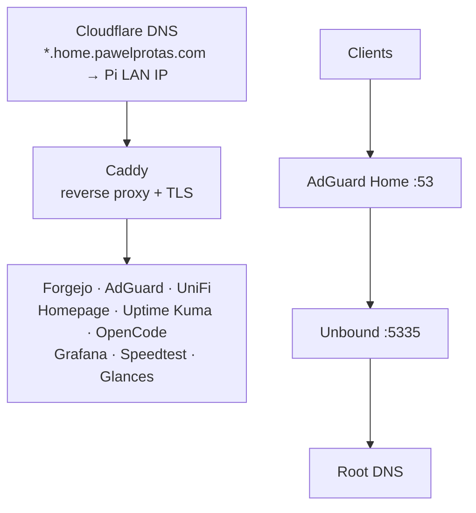

# Homelab

A single Docker Compose stack running on a Raspberry Pi, serving as a personal playground for networking, infrastructure, and self-hosting. Built for learning and daily use.

## Architecture



## What This Covers

**Reverse Proxy & TLS** — Caddy with automatic HTTPS via Cloudflare DNS-01 challenge. All services exposed through wildcard subdomain routing.

**DNS** — Full recursive DNS stack: AdGuard Home for ad blocking, forwarding to Unbound as a recursive resolver that talks directly to root nameservers. No reliance on upstream DNS providers.

**Monitoring & Alerting** — Glances exports system metrics to InfluxDB, visualized in Grafana with provisioned dashboards and alert rules. Uptime Kuma monitors service health. All alerts route to a self-hosted ntfy instance for push notifications.

**Network Management** — UniFi Network Application with MongoDB for managing network infrastructure. Tailscale as a subnet router for secure remote access.

**Self-Hosted Git** — Forgejo as a lightweight Git forge with SSH access, push-mirroring to GitHub via deploy keys.

**Infrastructure as Code** — Everything defined in a single `docker-compose.yml`. Grafana dashboards, datasources, and alerting provisioned via YAML. Secrets centralized in `.env` with variable substitution — nothing hardcoded.

**Container Maintenance** — Diun watches for image updates and sends notifications. AutoKuma auto-discovers services via Docker labels.

## Services

| Service | Purpose |
|---|---|
| [Caddy](https://github.com/caddyserver/caddy) | Reverse proxy, TLS termination |
| [AdGuard Home](https://github.com/AdguardTeam/AdGuardHome) | DNS ad blocker |
| [Unbound](https://github.com/NLnetLabs/unbound) | Recursive DNS resolver |
| [UniFi](https://github.com/linuxserver/docker-unifi-network-application) + [MongoDB](https://github.com/mongodb/mongo) | Network controller |
| [Tailscale](https://github.com/tailscale/tailscale) | VPN / subnet router |
| [Uptime Kuma](https://github.com/louislam/uptime-kuma) + [AutoKuma](https://github.com/BigBoot/AutoKuma) | Uptime monitoring |
| [Grafana](https://github.com/grafana/grafana) + [InfluxDB](https://github.com/influxdata/influxdb) | Metrics dashboards & alerting |
| [Glances](https://github.com/nicolargo/glances) | System monitoring agent |
| [Speedtest Tracker](https://github.com/alexjustesen/speedtest-tracker) | Scheduled speed tests |
| [Forgejo](https://codeberg.org/forgejo/forgejo) | Git forge |
| [Homepage](https://github.com/gethomepage/homepage) | Dashboard |
| [Ntfy](https://github.com/binwiederhier/ntfy) | Push notifications |
| [Diun](https://github.com/crazy-max/diun) | Container update notifier |
| [OpenCode](https://github.com/anomalyco/opencode) | AI coding agent |
| [iSponsorBlockTV](https://github.com/dmunozv04/iSponsorBlockTV) | YouTube TV ad/sponsor skipper |
| Barber Checker | Barber appointment availability notifier |

## Getting Started

```bash
# Clone
git clone git@github.com:pprotas/homelab.git
cd homelab

# Configure secrets
cp .env.example .env
# Edit .env with your own values

# Copy and edit configs that contain sensitive data
cp adguardhome/conf/AdGuardHome.yaml.example adguardhome/conf/AdGuardHome.yaml
cp isponsorblocktv/config.json.example isponsorblocktv/config.json

# Start everything
docker compose up -d
```

> **Note:** This stack is tailored to a specific environment (domain, network layout, hardware). It's shared as a reference and learning resource — not a turnkey solution.

## License

This project is for personal and educational use.
